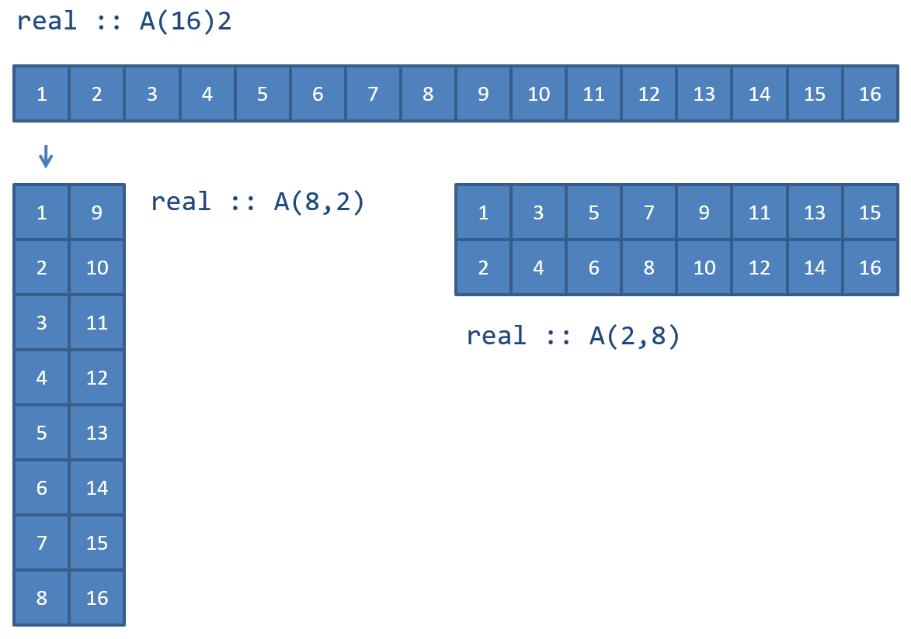
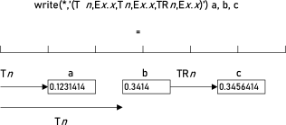
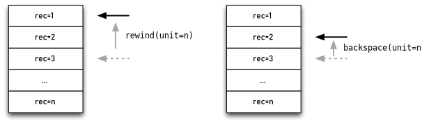
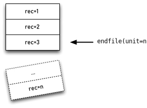

********************
The Fortran Language
********************

Fortran was the first high-level language and was developed in the fifties. The languages has since the developed through a number of standards Fortran IV (1966), Fortran 77, Fortran 90, Fortran 95, Fortran 2003, Fortran 2008 and the latest Fortran 2018. The advantages with standardised languages is that the code can be run on different computer architectures without modification. In every new standard the language has been extended with more modern language elements. To be compatible with previous standards older language elements are not removed. However, language elements that are considered bad or outdated can be removed after 2 standard revisions. As an example Fortran 90 is fully backwards compatible with Fortran 77, but in Fortran 95 some
older language constructs were removed.

The following sections gives a short introduction to the modern Fortran language from Fortran 90 and above. The description is centered on the most important language features. A more thorough description of the language can be found in the book Modern Fortran Explained [metcalfreid18]_.

Program structure
=================

Every Fortran-program must have a main program routine. From the main routine, other subroutines that make up the program are called. The syntax for a main program is:

.. code-block:: Fortran

    program [program-name]
    [specification statements]
    [executable statements]
    [contains]
    [subroutines]
    end [program [program-name]]

From the syntax it can be seen that the only identifier that must be included in main program definition is **end**.

The syntax for a subroutine and functions are defined in the same way, but the **program** identifier is replaced with **subroutine** or **function**. A proper way of organizing subroutines is to place these in separat files or place the in modules (covered in upcoming sections). Subroutines can also be placed in the main program **contains**-section, which is the preferred method if all subroutines are placed in the same source file. The code below shows a simple example of a main program with a subroutine in Fortran.

.. literalinclude:: ../../source/sample1/sample1.f90
   :language: Fortran
   :linenos:

The program source code can contain upper and lower case letters, numbers and special characters. However, it should be noted that Fortran does not differentiate between upper and lower case letters. The program source is written starting from the first position with one statement on each line. If a row is terminated with the charachter **\&**, this indicates that the statement is continued on the the next line. All text placed after the character **!** is a comment and wont affect the function of the program. Even if the comments don't have any function in the program they are important for source code readability. This is especially important for future modification of the program. In addition to the source code
form described above there is also the possibility of writing code in fixed form, as in Fortran 77 and earlier versions. In previous version of the Fortran standard this was the only source code form available.

Variables
=========

Variables are named references to data stored in memory. When specifying variables in Fortran, the data type of the data must also be specified. This means that Fortran is a strongly typed language compared to Python where data types of variables can change during code execution. Python is a dynamically typed language.

By default Fortran assumes that variables starting with letters I to N are assumed to be integers all other variables are assumed to be floating point variables (real). This is also called the implict type rule and is considered bad practice in Fortran, but is default because many Fortran programs are still relying on this rule. Modern Fortran application should always disable the implict type rule by adding the following statement in each code unit:

.. code-block:: Fortran
    
    implicit none

This is also described in more detail in the following sections.

Naming of variables
-------------------

Variables in modern Fortran consists of 1 to 31 alphanumeric characters (letters except   and , underscore and numbers). The first character of a variable name must be a letter. Allowable variable names can be:

.. code-block:: Fortran

    a
    a_thing
    x1
    mass
    q123
    time_of_flight

Variable names can consist of both upper case and lower case letters. It should be noted that **a** and **A** references the same variable. Invalid variables names can be:

.. code-block:: Fortran

    1a      ! First character not a letter
    a thing ! Contains a space character
    %       ! Contains a non-alphanumeric character

Data types and declarations
---------------------------

There are 5 built-in data types in Fortran:

 * integer, Integers.
 * real, Floating point numbers.
 * complex, Complex numbers.
 * logical, Boolean values.
 * character, Strings and characters.

The syntax for a variable declaration is:

.. code-block:: Fortran

    type [[,attribute]... ::] entity-list

**type** defines the variable type and can be **integer**, **real**, **complex**, **logical, **character** or **type( type-name )**. **attribute** defines additional special attributes or how the variable is to be used. The following examples shows
some typical Fortran variable declarations.

.. code-block:: Fortran

    integer :: a     ! Scalar integer variable
    real    :: b     ! Scalar floating point variable
    logical :: flag  ! boolean variable

    real :: D(10)    ! Floating point array consisting of 10 elements
    real :: K(20,20) ! Floating point array of 20x20 elements

    integer, dimension(10) :: C     ! Integer array of 10 elements

    character :: ch                 ! Character
    character, dimension(60) :: chv ! Array of characters
    character(len=80) :: line       ! Character string
    character(len=80) :: lines(60)  ! Array of strings

Constants are declared by specifying an additional attribute, **parameter**. A declared constant can be used in following variable declarations. An example of use is shown in the following example.

.. code-block:: Fortran

    integer, parameter :: A = 5 ! Integer constant
    real :: C(A)                ! Floating point array where
                                ! the number of elements is
                                ! specified by A

The precision and size of the variable type can be specified by adding a parenthesis directly after the type declaration. The variables **A** and **B** in the following example are declared as floating point scalars with different precisions. The number in the parenthesis denotes for many architectures, how many bytes a floating point variable is represented with. This is however not standardised and should not be relied upon.

.. code-block:: Fortran

    real(8) :: A
    real(4) :: B
    integer(4) :: I

To be able to choose the correct precision for a floating point variable, Fortran has a built in function **selected_real_kind** that returns the value to be used in the declaration with a given precision. This is illustrated in the following example.

.. code-block:: Fortran

    integer, parameter :: dp = selected_real_kind(15,300)
    real(kind=dp) :: X,Y

In this example the floating point variable should have at least 15 significant decimals and could represent numbers from :math:`10^{-300}` to :math:`10^{300}`. For several common architectures **selected_real_kind** will return the value 8. The advantage of using the above approach is that the precision of the floating point values can be specified in a architectural independent way. The precision constant can also be used when
specifying numbers in variable assignments as the following example illustrate.

.. code-block:: Fortran

    X = 6.0_dp

The importance of specifying the precision for assigning scalar values to variables is illustrated in the following example.

.. code-block:: Fortran

    program constants

        implicit none

        integer, parameter :: dp = selected_real_kind(15,300)

        real(dp) :: pi1, pi2
        pi1 = 3.141592653589793
        pi2 = 3.141592653589793_dp

        write(*,*) 'pi1 = ', pi1
        write(*,*) 'pi2 = ', pi2

        stop

    end program constants

The program gives the following results:

:: 

    pi1 = 3.14159274101257
    pi2 = 3.14159265358979

.. button-link:: https://godbolt.org/z/xsxzeM6ja
    :color: primary
    :outline:
    :class: sd-fs-6
    :align: left

    Run example

The scalar number assigned to the variable **pi1** is chosen by the compiler to be represented by the least number of bytes floating point precision, in this case **real(4)**, which is shown in the output from the above program.

Variable declarations in Fortran always precedes the executable statements in the main program or in a subroutine. Declarations can also be placed directly after the **module** identifier in modules.

Implicit type rule
------------------

Variable do not have to be declared in Fortran. The default is that variables starting I, J,..., N are defined as **integer** and variables starting with A, B,... ,H or O, P,... , Z are defined as **real**. This kind of implicit variable declaration is not recommended as it can lead to programming errors when variables are misspelled. To avoid implicit variable declarations the following declaration can be placed first in a program or module:

.. code-block:: Fortran

    implicit none

This statement forces the compiler to make sure that all variables are declared. If a variable is not declared the compilation is stopped with an error message. This is default for many other strongly typed languages such as, C, C++ and Java.

Assignment of variables
-----------------------

The syntax for scalar variable assignment is,

.. code-block:: Fortran
    
    variable = expr

where **variable** denotes the variable to be assigned and **expr** the expression to be assigned. The following example assign the **a** variable the value 5.0 with the precision defined in the constant **ap**.

.. code-block:: Fortran

    a = 5.0_dp

Assignment of boolean variables are done in the same way using the keywords, **.false.** and **.true.** indicating a true or false value. A boolean expression can also be used int the assignment. In the following example the variable, **flag**, is assigned the value **.false.**.

.. code-block:: Fortran
    
    flag =.false.

Assignment of strings are illustrated in the following example.

.. code-block:: Fortran

    character(40) :: first_name
    character(40) :: last_name
    character(20) :: company_name1
    character(20) :: company_name2

    ...

    first_name = 'Jan'
    last_name = "Johansson"
    company_name1 = "McDonald's"
    company_name2 = 'McDonald''s'

The first variable, **first_name**, is assigned the text ''Jan'', remaining characters in the string will be padded with spaces. A string is assigned using citation marks, '' or apostrophes, '. This can be of help when apostrophes or citation marks is used in strings as shown in the assignemnt of the variables, **company_name1** och **company_name2**.

Defined and undefined variables
-------------------------------

A variable in Fortran that has been assigned a value is considered to be defined and can be used safely. Variables that are not assigned values are said to be undefined and should not be used.

A program containing undefined variables will not fail compilation. Memory for undefined variables will be reserved and can be referenced. However, values of undefined variables are not automatically set to zero and references memory locations with unknown values. Often these variables will return garbage or random values. As rule always initialise variables to a default values or make sure they are assigned a value from another variable reference.

The following example shows an example of referencing defined and undefined variables.

.. code-block:: Fortran

    program undef1

        implicit none

        integer, parameter :: dp = selected_real_kind(15,300)

        real(dp) :: a, b
        character(40) :: s1, s2

        a = 42.0_dp ! --- Defined
        s1 = 'My defined string'

        print*, a
        print*, b
        print*, s1
        print*, s2

    end program undef1

This will print the following:

::

      42.000000000000000
      8.2890460584580950E-317
    My defined string

.. button-link:: https://godbolt.org/z/sTebccsTs
    :color: primary
    :outline:
    :class: sd-fs-6
    :align: left

    Run example

The reason for the 8.28...E-317 value is that the variable reference **b** points to its given memory location, but no value has been assigned to this location and will contain whatever was in memory when the program was executed. Fortran will interpret the values at this location as a floating point value and present it as such. This illustrates why it is a good idea to initialise variables to 0.0_dp or make sure they will be assigned values from other variable references.

Derived datatypes
-----------------

In certain cases it can be beneficial to create your own data types to handle the behavior of your program. To create new data types in Fortran you can create derived data types using the **type**-statement. Using this statement a new data type can be created by grouping existing Fortran data types into a new type. In the following example a data type of a particle is defined:

.. code-block:: Fortran

    type particle
        real(dp) :: x
        real(dp) :: y
        real(dp) :: z
        real(dp) :: m
    end type particle

The new data type can now be used like any other data type in Fortran. To create a variable reference to a derived data type the **type** keyword precedes the name of the data type in the declaration. As in the following example:

.. code-block:: Fortran

    type(particle) :: p0

The members of the derived data types are accessed using the **\%**-operator. In the following example the members of the variable **p0** are assigned values:

.. code-block:: Fortran

    p0 % x = 0.0_dp
    p0 % y = 0.0_dp
    p0 % z = 0.0_dp
    p0 % m = 1.0_dp

Derived data types can contain multiple Fortran data types:

.. code-block:: Fortran

    type particle
        real(dp)  :: x
        real(dp)  :: y
        real(dp)  :: z
        real(dp)  :: m
        logical   :: active
        integer   :: id
        character :: name(8)
    end type particle

Operators and expressions
=========================

The following arithmetic operators are defined in Fortran:

.. csv-table:: 
    :header: "Operator", "Description"

    "\*\*", "power to"
    "\*", "multiplication"
    "/", "division"
    "\+", "addition"
    "\-", "subtraction"

Parenthesis are used to specify the order of different operators. If no parenthesis are given in an expression operators are evaluated in the following order:

1. Operations with \*\*
2. Operations with \* or /
3. Operations with + or --

The following code illustrates operator precedence.

.. code-block:: Fortran

    c = a+b/2 ! is equivalent to :math:`a+(b/2)`
    c = (a+b)/2 ! in this case :math:`(a+b)` is evaluated and then :math:`/` 2

Relational operators:

.. csv-table:: 
    :header: "Operator", "Description"

    "< or .lt.", "less than"
    "<= or .le.", "less than or equal to"
    "> or .gt.", "greater than"
    ">= or .ge.", "greater than or equal to"
    "== or .eq.", "equal to"
    "/= or .ne.", "not equal to"

Logical operators:

.. csv-table:: 
    :header: "Operator", "Description"

    ".and.", "and"
    ".or.", "or"
    ".not.", "not"

Numeric expressions
===================

Numeric expressions in Fortran consist of operands of the built-in data types **integer**, \fkeyw{real} or **complex**.

If the operands only consists of integer it is important to note that integer divisions are rounded towards 0. The following example illustrates this:

.. code-block:: Fortran

    program expr1

        print*, 6/3
        print*, 8/3   ! 2.6666... rounded down to 2
        print*, -8/3  ! -2.666... rounded up to 2

    end program expr1

Running the program will result in the following output:

:: 

    2
    2
    -2

There are also some other things to be careful with when working with integer expressions. Consider the following example:

.. code-block:: Fortran

    program expr2

        print*, 2**3
        print*, 2**(-3)

    end program expr2

When run will give the following output:

.. code-block:: Fortran

    8
    0

The reason for the 0 in the second expression is that **2**(-3)** is the same as 1/2**3, which will be truncated to 0 as an integer expression.

When mixing data types in expressions, weaker data types will be converted to the stronger type. The result of the expression will be of the stronger type. **real** is stronger than **integer**. Consider the following code:

.. code-block:: Fortran

    real(dp) :: a
    integer :: i
    real(dp) :: b

    b = a * i

Here, the i variable reference will be converted to **real(dp)** when the expression is evaluated.

Arrays and matrices
===================

In scientific and technical applications matrices and arrays are important concepts. As Fortran is a language mainly for
technical computing, arrays and matrices play a vital role in the language.

Declaring arrays and matrices can be done in two ways. In the first method the dimensions are specified using the special attribute, **dimension**, after the data type declaration. The second method, the dimensions are specified by adding the dimensions directly after the variable name. The following code illustrate these methods of declaring arrays.

.. code-block:: Fortran

    integer, parameter :: dp = selected_real_kind(15,300)
    real(dp), dimension(20,20) :: K ! Matrix 20x20 elements
    real(dp) :: fe(6) ! Array with 6 elements

The default starting index in arrays is 1. It is however possible to define custom indices in the declaration, as the following example shows.

.. code-block:: Fortran

    real(ap) :: idx(-3:3)

This declares an array, **idx** with the indices [-3, -2,
-1, 0, 1, 2, 3], which contains 7 elements.

Array assignment
----------------

Arrays are assigned values either by explicit indices or the entire array in a single statement. The following code assigned the variable, **K**, the value 5.0 at position row 5 and column 6.

.. code-block:: Fortran

    K(5,6) = 5.0_dp

If the assignment had been written as

.. code-block:: Fortran

    K = 5.0_dp

the entire array, **K**, would have been assigned the value 5.0. This is an efficient way of assigning entire arrays
initial values.

Explicit values can be assigned to arrays in a single statement using the following assignment.

.. code-block:: Fortran

    real(dp) :: v(5) ! Array with 5 elements
    v = (/ 1.0_dp, 2.0_dp, 3.0_dp, 4.0_dp, 5.0_dp /)

This is equivalent to an assignment using the following statements.

.. code-block:: Fortran

    v(1) = 1.0_dp
    v(2) = 2.0_dp
    v(3) = 3.0_dp
    v(4) = 4.0_dp
    v(5) = 5.0_dp

The number of elements in the list must be the same as the number of elements in the array variable.

Assignments to specific parts of arrays can be achieved by slicing. The following example illustrates this concept.

.. code-block:: Fortran

    program slicing

        implicit none
        real :: A(4,4)
        real :: B(4)
        real :: C(4)

        B = A(2,:) ! Assigns B the values of row 2 in A
        C = A(:,1) ! Assigns C the values of column 1 in A

        stop

    end program slicing

Using slicing rows or columns can be assigned in single statements as shown in the following code:

.. code-block:: Fortran

    ! Assign row 5 in matrix K the values 1, 2, 3, 4, 5

    K(5,:) = (/ 1.0_dp, 2.0_dp, 3.0_dp, 4.0_dp, 5.0_dp /)

    ! Assign the array v the values 5, 4, 3, 2, 1

    v = (/ 5.0_dp, 4.0_dp, 3.0_dp, 2.0_dp, 1.0_dp /)

Array expressions
-----------------

In modern Fortran expressions can also be used on arrays. The operators will then apply element wise to the in the expression. For this to work the arrays must be of the same size. Array expression can also contain scalar values. These will be broadcast to the array elements. Consider the following arrays:

.. code-block:: Fortran

    real :: a(10,20), b(10,20), c(10,20)
    real :: u(5), v(5)

The following expression will divide all values in **a** with the values in **b**.

.. code-block:: Fortran

    c = a/b

This is equivalent to:

.. code-block:: Fortran

    do i=1,10
        do j=1,20
            c(i,j) = a(i,j)/b(i,j)
        end do
    end do

It is important to make sure the resulting variable on the left side of the assignment has the same size as the resulting array expression.

The following expression adds a scalar value to all elements in the array **v**:

.. code-block:: Fortran

    u = v + 1.0

This is equivalent to:

.. code-block:: Fortran

    do i=1,5
        u(i) = v(i) + 1.0
    end do

It is also possible to use slicing to extract a ''slice'' that can be used in an array expression:

.. code-block:: Fortran

    u = 5.0/v + a(1:5,5)

Which is equivalent to:

.. code-block:: Fortran

    do i=1,5
        u(i) = 5.0/v(i) + a(i,5)
    end do

Array storage
-------------

Memory allocation by the operating system is done in linear blocks of bytes. The operating system does not have the concept of multidimensional arrays. This is a concept introduced by the programming language, in this case Fortran, to make it easier for us to implement algorithms and access values stored in memory.

There are 2 conventions of storing 2D arrays in memory, by column and by row. Fortran as a convention stores arrays by column and C by row. The following figure illustrates this concept:

   Arrays in memory.

The storage of arrays in memory is especially important when calling libraries implemented in other languages, which usually stores arrays by row. The Python library NumPy by default stores all arrays using the C convention. Calling a Fortran subroutine with a pointer to these arrays will probably result in undefined behavior. NumPy supports column ordered arrays by supplying the array-constructor with the option \pkeyw{order=F}.

Allocatable arrays
------------------

In Fortran 77 and earlier versions of the standard it was not possible to dynamically allocate memory during program execution. This capability is now available in Fortran 90 and later versions. To declare an array as dynamically allocatable, the attribute **allocatable** must be added to the array declaration. The dimensions are also replaced with a colon, :, indicating the number of dimensions in the declared variable. A typical allocatable array declaration is shown in the following example.

.. code-block:: Fortran

    real, dimension(:,:), allocatable :: K

In this example the two-dimensional array, K, is defined as allocatable. To indicate that the array is two-dimensional is done by specifying **dimension(:,:)** in the variable attribute. To declare a one-dimensional array the code becomes:

.. code-block:: Fortran

    real, dimension(:), allocatable :: f

Variables with the **allocatable** attribute can't be used until memory is allocated. Memory allocation is done using the **allocate** method. To allocate the variables, **K,f**, in the previous examples the following code is used.

.. code-block:: Fortran

    allocate(K(20,20))
    allocate(f(20))

When the allocated memory is no longer needed it can be deallocated using the command, **deallocate**, as the following code illustrates.

.. code-block:: Fortran

    deallocate(K)
    deallocate(f)

An important issue when using dynamically allocatable variable is to make sure the application does not ''leak''. ''Leaking'' is term used by applications that allocate memory during the execution and never deallocate used memory. If unchecked the application will use more and more resources and will eventually make the operating system start swapping and perhaps become also become unstable. A rule of thumb is that an
**allocate** statement should always have corresponding **deallocate**.

Array subobjects
----------------

In many situations you want to work on smaller parts or slices of existing arrays. In Modern Fortran this can be accomplished by using the subobject feature. We will illustrate the concept of subobjects by an example. Consider the following declarations of an 2D- and 1D array:

.. code-block:: Fortran

    use utils

    real(dp) :: A(10,10)
    real(dp) :: v(10)

To make sure we don't have any junk values in the arrays, we initialise these with random values between 1 and 0.

.. code-block:: Fortran

    call init_rand()
    call set_print_format(10, 4, 'F')

    call rand_mat(A, 0.0_dp, 1.0_dp)
    call rand_vec(v, 0.0_dp, 1.0_dp)

We print the arrays, so that we can see the structure:

.. code-block:: Fortran

    call print_matrix(A, 'a')
    print*, loc(A)

    call print_vector(v, 'c')
    print*, loc(v)

The print-statements are added to show the actual memory address, so we can see what happens when we create subobjects.

:: 

    Matrix a ( 10 x  10) DP
    ---------------------------------------------------------------------- ...
        0.7112    0.6538    0.9200    0.7415    0.7460    0.4596    0.9778 ... 0.4111    0.0399    0.7354    0.9505    0.4428    0.7871    0.7390 ...
        0.9814    0.4057    0.4292    0.3406    0.6673    0.2120    0.9523 ...
        0.1369    0.5396    0.4405    0.7577    0.9942    0.7274    0.2653 ...
        0.7179    0.9883    0.5549    0.6374    0.1337    0.9464    0.7786 ...
        0.2915    0.8634    0.3962    0.8088    0.5708    0.9827    0.8841 ...
        0.8294    0.8191    0.5452    0.2079    0.1126    0.8199    0.2020 ...
        0.0706    0.6945    0.7744    0.3474    0.2566    0.6155    0.0921 ...
        0.3754    0.7855    0.9828    0.3965    0.9551    0.2119    0.2718 ...
        0.4026    0.5287    0.6198    0.9967    0.5866    0.6598    0.4024 ...
    ---------------------------------------------------------------------- ...
        140722079206560

    Vector c ( 10) DP
    ---------------------------------------------------------------------- ...
        0.9092    0.4976    0.6361    0.0355    0.7865    0.2197    0.8824 ...
    ---------------------------------------------------------------------- ...
        140722079206480

In the first example we are extracing the first column of the **A** array:

.. code-block:: Fortran

    call print_vector(A(:,1))
    print*, loc(A(:,1))

This will give us the following output:

:: 

    Vector ( 10)
    ---------------------------------------------------------------------- ...
        0.7112    0.4111    0.9814    0.1369    0.7179    0.2915    0.8294 ...
    ---------------------------------------------------------------------- ...
        140722079206560

From the output we can see that i seems to be the first column of the **A** array. We can also see that the memory location of the subobject is equivalent to the memory location of the **A**-array. This is due to the fact that memory for the **A**-array is stored column wise access a slice in this direction can be done directly without copying.

If we instead extract the first row of the **A**-array:

.. code-block:: Fortran

    call print_vector(A(1,:))
    print*, loc(A(1,:))

We get the following output:

:: 

    Vector ( 10)
    ---------------------------------------------------------------------- ...
        0.7112    0.6538    0.9200    0.7415    0.7460    0.4596    0.9778 ...
    ---------------------------------------------------------------------- ...
                10278912

Here we can see that the memory location is in a completely different location. This is due to the fact that the compiler needs to make a temporary copy to create this slice. This is important to think about especially if working with large array slices that are passed in subroutine calls. This can lead to crashes as these slices often are allocated on the stack.

Below illustrates some other examples of using array sub objects:

.. code-block:: Fortran

    call print_matrix(A(1:2,1:2))

    call print_matrix(A(1:6:2,1:6:2))
    print*, loc(A(1:6:2,1:6:2))

    call print_matrix(A(:,1:2))
    print*, loc(A(:,1:2))

This gives the following output:

::

    Matrix (  2 x   2) DP
    --------------------
        0.1233    0.2606
        0.8357    0.4479
    --------------------
                27678720

    Matrix (  3 x   3) DP
    ------------------------------
        0.1233    0.7812    0.1668
        0.4284    0.3687    0.6542
        0.2531    0.3314    0.3557
    ------------------------------
                27689200

    Matrix ( 10 x   2) DP
    --------------------
        0.1233    0.2606
        0.8357    0.4479
        0.4284    0.2254
        0.3541    0.3400
        0.2531    0.6490
        0.6420    0.5396
        0.5006    0.5849
        0.7185    0.3138
        0.8209    0.6203
        0.0232    0.9131
    --------------------
        140728814257696

Conditional statements
======================

One of the more important concepts in a programming language is the ability to execute code depending on certain conditions are fulfilled. Modern Fortran support this through the **if**- and the **select**-statement, which are described in this section.

The simplest form of if-statements in Fortran have the following syntax

.. code-block:: Fortran

    if (scalar-logical-expr) then
        block
    end if

where **scalar-logical-expr** is a boolean expression, that has to be evaluated as true, (**.true.**), for the statements in, **block**, to be executed. An extended version of the if-statement adds a **else**-block with the following syntax

.. code-block:: Fortran

    if (scalar-logical-expr) then
        block1
    else
        block2
    end if

In this form the **block1** will be executed if **scalar-logical-expr** is evaluated as true, otherwise **block2** will be executed. A third form of if-statement contains one or more **else if**-statements with the following syntax:

.. code-block:: Fortran

    if (scalar-logical-expr1) then
        block1
    else if (scalar-logical-expr2) then
        block2
    else
        block3
    end if

In this form the **scalar-logical-expr1** is evaluated first. If this expression is true **block1** is executed, otherwise if **scalar-logical-expr2** evaluates as true **block2** is executed. If no other expressions are evaluated to true, **block3** is executed. An if-statement can contain several **else if**-blocks. The use of if-statements is illustrated in the following example:

.. literalinclude:: ../../source/logic/logic.f90
   :language: Fortran
   :linenos:

Another conditional construct is the case-statement.

.. code-block:: Fortran

    select case (expression)
        case selector 
            block  
    end select

In this statement the expression, **expression** is evaluated and the **case**-block with the corresponding **selector** is executed. To handle the case when no **case**-block corresponds to the **expr**, a **case**-block with the **default** keyword can be added. The syntax then becomes:

.. code-block:: Fortran

    select case (expr)
        case selector
            block
        case default
            block
    end select

Example of case-statement use is shown in the following example:

.. code-block:: Fortran

    select case (display_mode)
        case (displacements)
            ...
        case (geometry)
            ...
    end select

To handle the case when **display_mode** does not correspone to any of the alternatives the above code is modified to the following code.

.. code-block:: Fortran

    select case (display_mode) case (displacements)
            ...
        case (geometry)
            ...
        case default
            ...
    end select

The following program example illustrate how case-statements can be used.

.. literalinclude:: ../../source/case/case.f90
   :language: Fortran
   :linenos:

.. button-link:: https://godbolt.org/z/5PnrGPTqo
    :color: primary
    :outline:
    :class: sd-fs-6
    :align: left

    Run example

Repetitive statements
=====================

The most common repetitive statement in Fortran is the **do**-statement. The syntax is:

.. code-block:: Fortran

    do variable = expr1, expr2 [,expr3]
        block
    end do

**variable** is the control-variable of the loop. **expr1** is the starting value, **expr2** is the end value and **expr3** is the step interval. If the step interval is not given it is assumed to be 1. There are two ways of controlling the execution flow in a **do**-statement. The **exit** command terminates the loop and program execution is continued after the **do**-statement. The **cycle** command terminates the execution of the current block and continues execution with the next value of the control variable. The example below illustrates the use of a **do**-statement.

.. code-block:: Fortran

    program loop_sample

        implicit none

        integer :: i

        do i=1,20
            if (i>10) then
                write(*,*) 'Terminates do-statement.'
                exit
            else if (i<5) then
                write(*,*) 'Cycling to next value.'
                cycle
            end if
            write(*,*) i
        end do

        stop

    end program loop_sample

The above program gives the following output:

:: 

    Cycling to next value.
    Cycling to next value.
    Cycling to next value.
    Cycling to next value.
    5
    6
    7
    8
    9
    10
    Terminates do-statement.

Another repetitive statement available is the **do while**-statement. With this statement, the code block can execute until a certain condition is fulfilled. The syntax is:

.. code-block:: Fortran

    do while (scalar-logical-expr)
        block
    end do

The following code shows a simple **do while**-statement printing the function :math:`f(x)=sin(x)`.

.. code-block:: Fortran

    x = 0.0
    do while x<1.05
        f = sin(x)
        x = x + 0.1
        write(*,*) x, f
    end do

There are other repetitive statements such as **forall** and **where** covered int the array features sections.

Built-in functions
==================

Fortran has a number of built-in functions covering a number of different areas. The following tables list a selection of these. For a more thorough description of the built-in function please see, Metcalf and Reid [metcalfreid18]_.

Mathematical functions
----------------------

.. csv-table:: 
    :header: "Function", "Description"

    "acos(x)", "Returns :math:`\arccos(x)`"
    "asin(x)", "Returns :math:`\arcsin(x)`"
    "atan(x)", "Returns :math:`\arctan(x)`"
    "atan2(y,x)", "Returns :math:`\arctan(\frac{y}{x})` from :math:`-\pi` till math:`-\pi`"
    "cos(x)", "Returns :math:`\cos(x)`"
    "cosh(x)", "Returns :math:`\cosh(x)`"
    "exp(x)", "Returns :math:`e^{x}`"
    "log(x)", "Returns :math:`\ln(x)`"
    "log10(x)", "Returns :math:`\lg(x)`"
    "sin(x)", "Returns :math:`\sin(x)`"
    "sinh(x)", "Returns :math:`\sinh(x)`"
    "sqrt(x)", "Returns :math:`\sqrt{x}`"
    "tan(x)", "Returns :math:`\tan(x)`"
    "tanh(x)", "Returns :math:`\tanh(x)`"

Miscellaneous conversion functions
----------------------------------

.. csv-table:: 
    :header: "Function", "Description"

    "abs(a)", "Returns absolute value of a"
    "aint(a)", "Truncates a floating point value"
    "int(a)", "Converts a floating point value to an integer"
    "nint(a)", "Rounds a floating point value to the nearest integer"
    "real(a)", "Converts an integer to a floating point value"
    "max(a1,a2[,a3,...])", "Returns the maximum value of two or more values"
    "min(a1,a2[,a3,...])", "Returns the minimum value of two or more values"

Vector and matrix functions
---------------------------

.. csv-table:: 
    :header: "Function", "Description"

    "dot_product(u, v)", "Returns the scalar product of :math:`u\cdot v`"
    "matmul(A, B)", "Matrix multiplication. The result must have the same for as :math:`\mathbf{AB}`"
    "transpose(C)", "Returns the transpose :math:`\mathbf{C}^{T}`. Elementet :math:`C^{T}_{ij}` motsvarar :math:`C_{ji}`"

Array functions
---------------

.. csv-table:: 
    :header: "Function", "Description"

    "all(mask)", "Returns true of all elements in the logical array **mask** are true. For example all(A>0)! returns true if all elements in :math:`\mathbf{A}` are greater than 0."
    "any(mask)", "Returns true if any of the elements in **mask** are true."
    "count(mask)", "Returns the number of elements in **mask** that are true."
    "maxval(array)", "Returns the maximum value of the elements in the array **array**."
    "minval(array)", "Returns the minimum value of the elements in the array **array**."
    "product(array)", "Returns the product of the elements in the array **array**."
    "sum(array)!", "Returns the sum of elements in the array **array**."

Most built-in functions and operators in Fortran support arrays. The following example shows how functions and operators support operations on arrays.

.. code-block:: Fortran

    real, dimension(20,20) :: A, B, C

    C = A/B ! Division :math:`C_{ij}=A_{ij}/B_{ij}`

    C = sqrt(A) ! Square root :math:`C_{ij}=\sqrt{A_{ij}}`

The following example shows how a stiffness matrix for a bar element easily can be created using these functions and operators. The Matrix :math:`\mathbf{K}_{e}` is defined as follows

.. math::

    \mathbf{K}_{e} =(\mathbf{G}^{T} \mathbf{K}_{el} )\mathbf{G}

The :math:`G^T` is returned by using the Fortran function **transpose** and the matrix multiplications are performed with **matmul**. The matrices :math:`\mathbf{K}_{el}` and :math:`\mathbf{G}` are defined as

.. math::

    \mathbf{K}_{el} =\frac{EA}{L} \left[
    \begin{array}{cc}
    1 & -1 \\
    -1 & 1 \\
    \end{array}
    \right]

and

.. math::

    \mathbf{G}=\left[
    \begin{array}{cccccc}
    n_{x}  & n_{y}  & n_{z}  & 0 & 0 & 0 \\
    0 & 0 & 0 & n_{x} & n_{y} & n_{z} \\
    \end{array}
    \right]

Length and directional cosines are defined as

.. math::

    L=\sqrt{(x_{2} -x_{1} )^{2} +(y_{2} -y_{1} )^{2} +(z_{2} -z_{1})^{2}}

.. math::

    n_{x} =\frac{x_{2} -x_{1} }{L} ,\,\,\,n_{y} =\frac{y_{2} -y_{1}}{L} ,\,\,\,n_{z} =\frac{z_{2} -z_{1} }{L}

In the example the input parameters are assigned the following values:

.. math::

    x_{1} =0,\,y_{1} =0,\,z_{1} =0 \\
    x_{2} =1,\,y_{2} =1,\,z_{2} =1 \\
    E=1,A=1

.. literalinclude:: ../../source/functions/functions.f90
   :language: Fortran
   :linenos:

.. button-link:: https://godbolt.org/z/7eKGseGPE
    :color: primary
    :outline:
    :class: sd-fs-6
    :align: left

    Run example

The program produces the following output

:: 

    0.1925    0.1925    0.1925    -.1925    -.1925    -.1925
    0.1925    0.1925    0.1925    -.1925    -.1925    -.1925
    0.1925    0.1925    0.1925    -.1925    -.1925    -.1925
    -.1925    -.1925    -.1925    0.1925    0.1925    0.1925
    -.1925    -.1925    -.1925    0.1925    0.1925    0.1925
    -.1925    -.1925    -.1925    0.1925    0.1925    0.1925

For a more thorough description of matrix handling in Fortran 90/95, see Metcalf and Reid [metcalfreid18]_

Elemental procedures
--------------------

Vector and matrix functions
---------------------------

Reduction routines
------------------

Information functions
---------------------

Program units and subroutines
=============================

Subprograms
-----------

A subroutine in Fortran 90/95 has the following syntax

.. code-block:: Fortran

    subroutine subroutine-name[([dummy-argument-list])]
        [argument-declaration]
        ...
        return
    end subroutine [subroutine-name]

All variables in Fortran program are passed to subroutines as references to the actual variables. Modifying a parameter in a subroutine will modify the values of variables in the calling subroutine or program. To be able to use the variables in the argument list they must be declared in the subroutine. This is done right after the subroutine declaration. When a subroutine is finished control is returned to the calling routine or program using the **return**-command. Several return statements can exist in subroutine to return control to the calling routine or program. This is illustrated in the following example.

.. code-block:: Fortran

    subroutine myproc(a,B,C)
        implicit none
        integer :: a
        real, dimension(a,*) :: B
        real, dimension(a) :: C
        .
        .
        .
        return
    end subroutine

A subroutine is called using the **call** statement. The above subroutine is called with the following code.

.. code-block:: Fortran

    call myproc(a,B,C)

It should be noted that the names used for variables are local to each respective subroutine. Names of variables passed as arguments does not need to have the same name in the calling and called subroutines. It is the order of the arguments that determines how the variables are referenced from the calling subroutine.

In the previous example illustrates how to make the subroutines independent of problem size. The dimensions of the arrays are passed using the **a** parameter instead of using constant values. The last index of an array does not have to specified, indicated with a \*, as it is not needed to determine the address to array element.

Functions
---------

Functions are subroutines with a return value, and can be used in different kinds of expressions. The syntax is

.. code-block:: Fortran

    type function function-name([dummy-argument-list])
        [argument-declaration]
        ...
        function-name = return-value
        ...
        return
    end function function-name

The following code shows a simple function definition returning the value of :math:`sin(x)`

.. code-block:: Fortran

    real function f(x)
        real :: x
        f=sin(x)
        return
    end function f

The return value defined by assigning the name of the function a value. As seen in the previous example. The function is called by giving the name of the function and the associated function arguments.

.. code-block:: Fortran

    a = f(y)

The following example illustrates how to use subroutines to assign an element matrix for a three-dimensional bar element. The example also shows how dynamic memory allocation can be used to allocate matrices. See also the example in section XX

.. literalinclude:: ../../source/subroutines/subroutines.f90
   :language: Fortran
   :linenos:

The program gives the following output.

:: 

    0.1925    0.1925    0.1925    -.1925    -.1925    -.1925
    0.1925    0.1925    0.1925    -.1925    -.1925    -.1925
    0.1925    0.1925    0.1925    -.1925    -.1925    -.1925
    -.1925    -.1925    -.1925    0.1925    0.1925    0.1925
    -.1925    -.1925    -.1925    0.1925    0.1925    0.1925
    -.1925    -.1925    -.1925    0.1925    0.1925    0.1925

.. button-link:: https://godbolt.org/z/jvv3o4faP
    :color: primary
    :outline:
    :class: sd-fs-6
    :align: left

    Run example

Keyword and optional arguments
------------------------------

Sometimes when implementing subroutines the number of arguments can grow, making the usage of the unnecessary complicated. To solve this wrapper subroutines could be written providing default parameters for main subroutines. This has the drawback of additional maintenance of the wrapper subroutines when the main subroutine is changed. Fortran 2003 provides a solution to this using keyword and optional arguments. An additional parameter attribute, **optional**, can be specified when declaring subroutine parameters. In the following example the, **c** is declared optinal and does not need to be given when the routine is called.

.. code-block:: Fortran

    subroutine dostuff(A, b, c)

        real    :: A(10,10)
        integer :: b
        integer, optional :: c
        ...
        

The **dostuff** routine can be called in 2 ways:

.. code-block:: Fortran

    call dostuff(A, b)    ! c is omitted as it is optional
    call dostuff(A, b, c)

If a routine is called without optional parameters the routine has to be able to determine if a parameter used this can be done using a special function, **present(...)**. This functions returns **.true.** if given parameter is present in the call to the subroutine.

In addition of having optional parameters, subroutine parameters can also be specified by parameter name or keyword. In the following example all these techniques are employed when implementing the **order_icecream** subroutine. This routine only has one required argument, **number**. The other parameters are optional as indicated by the, **optional** in the parameter declaration.

.. literalinclude:: ../../source/optional_arguments/main.f90
   :language: Fortran
   :linenos:

.. button-link:: https://godbolt.org/z/7jGhavbfq
    :color: primary
    :outline:
    :class: sd-fs-6
    :align: left

    Run example

In the last call the **topping** keyword is used to specify the last optional argument, but leaving the **flavor** parameter undefined.

Procedure arguments
-------------------

An efficient feature that exists in many other languages is the ability to pass subroutines as arguments to subroutines. This can provide efficient ways to provide algorithms with user provided functions to be used within the algorithm. As an example, a function can be input to a numeric differentiation algorithm as a subroutine parameter. It is now possible to do this in Fortran 2003.

To implement a subroutine that takes a function as an input parameter, the function definition has to be declared in the subroutine parameter declaration using an **interface** block.

.. code-block:: Fortran

    real function integrate(a, b, func)

        real :: a, b
        
        interface
            real function func(x)
                real, intent(in) :: x
            end function func
        end interface
        
        ...

The routine can then be called by providing a function with the same interface as input to the function:

.. code-block:: Fortran

    real function myfunc(x)
        
        real :: x
        
        myfunc = sin(x)**2
        
    end function myfunc

Calling the **integrate** function then becomes:

.. code-block:: Fortran

    area = integrate(0.0, 1.0, myfunc)

.. literalinclude:: ../../source/procedures_as_arguments/utils.f90
   :language: Fortran
   :linenos:

.. literalinclude:: ../../source/procedures_as_arguments/main.f90
   :language: Fortran
   :linenos:

Modules
-------

When programs become larger, they often need to be split into more manageable parts. In other languages this is often achieved using include files or packages. In Fortran 77, no such functionality exists. Source files can be grouped in files, but no standard way of including specific libraries of subroutines or function exists in the language. The C preprocessor is often used to include code from libraries in Fortran, but is not standardised in the language itself.

In Fortran 90 the concept of modules was introduced. A Fortran 90 module can contain both variables, parameters and subroutines. This makes it possible to divide programs into well defined modules which are more easily maintained. The syntax for a module is similar to that of how a main program in Fortran is defined.

.. code-block:: Fortran

    module module-name 
        [specification-stmts] 
    contains
        module-subprograms]
    end module [module-name]]

The block **specification-stmts** defines the variables that are available for programs or subroutines using the module. In the block, **module\--sub\-programs**, subroutines in the module are declared. A module can contain only variables or only subroutines or both. One use of this, is to declare variables common to several modules i a separate module. Modules are also a good way to divide a program into logical and coherent parts. Variables and functions in a module can be made private to a module, hiding them for routines using the module. The keywords **public** and **private** can be used to control the access to a variable or a function. In the following code the variable, **a**, is hidden from subroutines or programs using this module. The variable, **b**, is however visible. When nothing is specified in the variable declaration, the variable is assumed to be public.

.. code-block:: Fortran

    module mymodule

        integer, private :: a
        integer :: b
        ...

The ability to hide variables in modules enables the developer to hide the implementation details of a module, reducing the risk of accidental modification variables and use of subroutines used in the implementation.

To access the routines and variables in a module the **use** statement is used. This makes all the public variables and subroutines available in programs and other modules. In the following example illustrate how the subroutines use in the previous examples are placed in a module, **truss**, and used from a main program.

.. literalinclude:: ../../source/modules/module_truss.f90
   :language: Fortran
   :linenos:

Main program using the **truss** module.

.. literalinclude:: ../../source/modules/module_main.f90
   :language: Fortran
   :linenos:

Please note that the declaration of **ap** in the **truss** module is used to define the precision of the variables in the main program.

Public and private attributes
-----------------------------

When implementing modules, some of the routines and variables are only used the implementation of the module. That is, some of the variables and subroutines should not be accessible for the user of the module. To control access to variables and subroutines the attributes **private** and **public** can be used in the declaration of variables and subroutines. A variable can be declared private by adding the keyword **private** to the attribute list in the declaration as shown in the following example:

.. code-block:: Fortran

    real, private :: a

If no **private** attribute is given the variable is by default declared as **public**. If a private variable is access from another module a main program will generate a compiler error.

To declare a subroutine or function as private it has to be declared as such in the specification part of the module, that is before the **contains**-keyword. In the following example illustrates the concept.

.. code-block:: Fortran

    module mymodule

        private myprivatesub
        
    contains

        subroutine myprivatesub
        
            print *, 'This subroutine can only be called from within the module.'
        
        end subroutine myprivatesub
        
        subroutine mypublicsub
        
            print *, 'This subroutine can be called from other modules.'
        
        end subroutine mypublicsub
        
    end module mymodule

In this example, **myprivatesub**, can only be called from within the module. Calling it from another module or main program will result in a compiler error. **myprivatesub** is not declared as private in the specification part and hence can be called from all other modules.

Overloading
-----------

As Fortran is a strongly typed language, supporting multiple data types in a single subroutine is not possible and requires separate unique subroutines declarations. To simplify module use and enable a module user to call a routine with different data types, Fortran 90 supports the concept of overloading. Using overloading the compiler can decide which routine to call depending on the datatype used. However, this requires a special declaration in the module specification.

To illustrate this, a function, **func**, is implemented that can take either a floating point parameter or an integer parameter. To implement this function, an interface declaration for **func** is added in the module specification part:

.. code-block:: Fortran

    module overloaded

        interface func
            module procedure ifunc, rfunc
        end interface
        ...

This tells the compiler to map the **func**-function to the functions **ifunc** or **rfunc**, depending on the datatype used when the function is called. **ifunc** or **rfunc** are implemented as normal functions as shown below:

.. code-block:: Fortran

        ...
        
    contains

    integer function ifunc(x)
        
        integer, intent(in) :: x
        ifunc = x * 42
        
    end function ifunc

    real function rfunc(x)
        
        real, intent(in) :: x
        rfunc = x / 42.0
        
    end function rfunc

    end module overloaded

The **func**-function can now be called using either floating point values or integer values illustrated below in the following example:

.. code-block:: Fortran

    program overloading

        use special
        
        integer :: a = 42
        real :: b = 42.0
        
        a = func(a)
        b = func(b)
        
        print *, a
        print *, b
        
    end program overloading

Running this program produce the following output:

::

    $ ./overloading
            1764
    1.0000000000000000

This means that **ifunc** is called in the first call to **func** and **rfunc** is called in the second call to **func**.

operator overloading
--------------------

In many modern languages such as C++ and Python, the operators can be overloaded to support expressions for user implemented data types. This is also possible in Fortran. To illustrate how this is achieved, a **vector_operations**-module is implemented, enabling addition of vectors using the + operator.

First, a vector type is defined in our module **vector_operations**. This is the actual data type that will be used in the expressions to be evaluated.

.. code-block:: Fortran

    module vector_operations

        type vector
            real :: components(3)
        end type vector
        ...

Next, an interface for overloading the + operator is defined. The interface tells the compiler which function to call when it encounters an expression with our vector data type. In this example the **vector_plus_vector**-function will be called for the + operator.

.. code-block:: Fortran

        ...
        interface operator(+)
            module procedure vector_plus_vector
        end interface
        ...

In the final step the actual function for adding vectors is implemented. This functions needs to have two input parameters for the vectors to be added in the operation. It also needs to return a **vector** data type.

.. code-block:: Fortran

    ...
    contains

    type(vector) function vector_plus_vector(v1, v2)

        type(vector), intent(in) :: v1, v2
        vector_plus_vector%components = v1%components + v2%components
        
    end function vector_plus_vector

    end module vector_operations

The new data type together with the defined + operator can now be used to implement compact expressions for vector algebra as illustrated in the following code:

.. code-block:: Fortran

    program operator_overloading

        use vector_operations

        type(vector) :: v1
        type(vector) :: v2
        type(vector) :: v
        
        v1%components = (/1.0, 0.0, 0.0/)
        v2%components = (/0.0, 1.0, 0.0/)
        
        v = v1 + v2
        
        print *, v

    end program operator_overloading

Running the code will produced the expected output:

::

    $ ./opoverload
      1.0000000000000000        1.0000000000000000        0.0000000000000000

Operators for -, * and / can be implemented using the same technique.

Allocatable dummy arguments
---------------------------

.. literalinclude:: ../../source/allocatable_dummy/main.f90
   :language: Fortran
   :linenos:

Allocatable functions
---------------------

.. literalinclude:: ../../source/allocatable_function/main.f90
   :language: Fortran
   :linenos:

Submodules (2003)
-----------------

.. literalinclude:: ../../source/submodules/points.f90
   :language: Fortran
   :linenos:

.. literalinclude:: ../../source/submodules/points_a.f90
   :language: Fortran
   :linenos:

.. literalinclude:: ../../source/submodules/main.f90
   :language: Fortran
   :linenos:

Input and output
================

Input and output to and from different devices, such as screen, keyboard and files are accomplished using the commands **read** and **write**. The syntax for these commands are:

.. code-block:: Fortran

    read(u, fmt) [list]
    write(u, fmt) [list]

**u** is the device that is used for reading or writing. If a star (*) is used as a device, standard output and standard
input are used (screen, keyboard or pipes).

**fmt** is a string describing how variables should be read or written. This is often important when writing results to text files, to make it more easily readable. If a star (*) is used a so called free format is used, no special formatting is used. The format string consists of one or more format specifiers, which have the general form:

.. code-block:: Fortran

    [repeat-count] format-descriptor w[.m]

where **repeat-count** is the number of variables that this format applies to. **format-descriptor** defines the type of format specifier. **w** defined the width of the output field and **m** is the number of significant numbers or decimals in the output. The following example outputs some numbers using different format specifiers and table~\ref{table:formatkoder} show the most commonly used format specifiers.

.. literalinclude:: ../../source/formatting/formatting.f90
   :language: Fortran
   :linenos:

The program produces the following output:

.. code-block:: Fortran

    123456789012345
        5.676
        0.6758E-01
        0.6758E+00
            0.6758
    0.675779000000000
                156
            156

..
    \begin{table}
    \begin{center}
    \begin{tabular}{|l|l|}
    \hline
    Kod & Beskrivning \\
    \hline
    E   & Scientific notation. Values are converted to the format "-d.dddE+ddd". \\
    F   & Decimal notation. Values are converted to the format "-d ddd.ddd...". \\
    G   & Generic notation. Values are converted to the format -ddd.ddd or -d.dddE+ddd \\
    I   & Integers. \\
    A   & Strings \\
    TRn & Move :math:`n` positions right \\
    Tn  & Continue at position :math:`n` \\
    \hline
    \end{tabular}
    \end{center}
    \caption{Formatting codes in \fkeyw{read}/**write**}
    \label{table:formatkoder}
    \end{table}

During output a invisible cursor is moved from left to right. The format specifiers TR:math:`n` and T:math:`n` are used to move this cursor. TR:math:`n` moves the cursor :math:`n` positions to the right from the previous position. T:math:`n` places the cursor at position :math:`n`. :numref:`fig-format-positioning` shows how this can be used in a write-statement.

   Positioning of output in Fortran 90/95

The output routines in Fortran was originally intended to be used on row printers where the first character was a control character. The effect of this is that the default behavior of these routines is that output always starts at the second position. On modern computers this is not an issue, and the first character can be used for printing. To print from the first character, the format specifier **T1** can be used to position the cursor at the first position. The following code writes ''Hej hopp!'' starting from the first position.

.. code-block:: Fortran

    write(*,'(T1,A)') 'Hej hopp!'

A more thorough description of the available format specifiers in Fortran is given in Metcalf and Reid [metcalfreid18]_.

Reading and Writing from files
------------------------------

The input and output routines can also be used to write data to and from files. This is accomplished by associating a file in the file system with a file unit number, and using this number in the **read** and **write** statements to direct the input and output to the correct files. A file is associated, opened, with a unit number using an **open**-statement. When operations on the file is finished it is closed using the
**close**-statement.

The file unit number is an integer usually between 1 and 99. On many systems the file unit number 5 is the keyboard and unit 6 the screen display. It is therefore recommended to avoid using these numbers in file operations.

In the **open**-statement the properties of the opened files are given, such as if the file already exists, how the file is accessed (reading or writing) and the filename used in the filesystem.

An example of reading and writing file is given in the following example.

.. literalinclude:: ../../source/sample2/sample2.f90
   :language: Fortran
   :linenos:

In this example, 2 files are opened, \ffname{indata.dat} and \ffname{utdata.dat} with **open**-statements. Using the **read**-statement five rows with 3 numbers on each row are read from the file \ffname{indata.dat}. The sum of each row is calculated and is written using **write**-statements to the file \ffname{utdata.dat}. Finally the files are closed using the **close**-statements.

Dynamic format codes
--------------------

One problem that arises when writing formatted output, is how to handle output of data in which the number of columns is unknown at compile time. To solve this, a special technique using strings as file units can be employed. To illustrate this technique we implement a subroutine **writeArray**, which takes an array of any size as input and tries to print it nicely. First we declare the module subroutine and extract the size of the incoming array:

.. code-block:: Fortran

    subroutine writeArray(A)
            
        real(8), dimension(:,:) :: A
        integer :: rows, cols, i, j
        character(255) :: fmt
            
        rows = size(A,1)
        cols = size(A,2)

        ...

Next, we use a **write**-statement, that instead of a file unit number takes the string, **fmt**, and uses it as an output file. In the **write**-statement, we write out the needed format code for printing the incoming array, which is then stored in the string **fmt**.

.. code-block:: Fortran

        ...
        write(fmt, '(A,I1,A)') '(',cols, 'G8.3)'
        ...

The generated format code can now be used when printing the incoming array **A**.

.. code-block:: Fortran

     ...
        do i=1,rows
            print fmt, (A(i,j), j=1,cols)
        end do
            
        return
     end subroutine writeArray

In the following main program, the implemented **writeArray** subroutine is used to print a 6 by 6 matrix.

.. code-block:: Fortran

    program dynamic_fcodes

        use array_utils

        real(8) :: A(6,6)
        
        A = 42.0_8
        
        call writeArray(A)
        
    end program dynamic_fcodes

The resulting formatted output is shown below:

::

    $ ./dynamic_fcodes
    42.0    42.0    42.0    42.0    42.0    42.0
    42.0    42.0    42.0    42.0    42.0    42.0
    42.0    42.0    42.0    42.0    42.0    42.0
    42.0    42.0    42.0    42.0    42.0    42.0
    42.0    42.0    42.0    42.0    42.0    42.0
    42.0    42.0    42.0    42.0    42.0    42.0

Namelist I/O
------------

The standard way of writing or reading text files in Fortran is using list directed I/O. This means specifying a list of variables to be read or written using the **read**- and **write**-statements. Fortran will automatically handle the conversion of datatypes to and from a text based format. A more flexible way of handling text file I/O is using namelists. Namelists can be considered as named list of variables to be used for reading or writing. In this scheme, variables can be read and written to files using names. To write variables and data using this technique, variables must be listed using the special **namelist** statement as shown below:

.. code-block:: Fortran

    integer :: no_of_eggs, litres_of_milk, kilos_of_butter, list(5)
    namelist /food/ no_of_eggs, litres_of_milk, kilos_of_butter, list

Here a namelist, **food**, is defined consisting of the specified variables. Variables in a namelist can be of any type. To write the variables to a file, the **nml**-keyword can be used in the **read**- and **write**-statements to specify which namelist that should be used.

The namelist in the text file starts with the \& character followed by the namelist-name then the namelist variable pairs are listed separated by commas. The namelist is ended with a single /. The following example shows 2 namelist entries in a text file:

::

    &food litres_of_milk=5, no_of_eggs=12, kilos_of_butter=42, list=1,2,3,4,5 /
    &food litres_of_milk=6, no_of_eggs=24, kilos_of_butter=84, list=2,3,4,5,6 /

Multiple namelist entries can be read from an opened file. The following code shows how 2 namelist entries of the type **food** are read from an opened file:

.. code-block:: Fortran

    open(unit=ir, file='food.txt', status='old')
    read(ir, nml=food)
    print *, no_of_eggs, litres_of_milk, kilos_of_butter
    read(ir, nml=food)
    print *, no_of_eggs, litres_of_milk, kilos_of_butter
    close(unit=ir)

Running this code produces the following output:

::

          12           5          42
          24           6          84

\fmode

Writing using namelist I/O is done in the same way as reading. The following code shows how the same namelist variables are written to a namelist:

.. code-block:: Fortran

    open(unit=iw, file='food2.txt', status='new')
    write(iw, nml=food)
    close(unit=iw)

The contents of the written file, **food2.txt**, is shown below:

::

    &FOOD
    NO_OF_EGGS=         24,
    LITRES_OF_MILK=          6,
    KILOS_OF_BUTTER=         84,
    LIST=          2,          3,          4,          5,          6,

    /

Pleas notice that Fortran allways uses uppercase for variable names in the written file.

.. literalinclude:: ../../source/namelist_io/main.f90
   :language: Fortran
   :linenos:

Unformatted I/O
---------------

In the previous sections data was read and written in human readable text format. For larger data structures this can be very inefficient. To solve this Fortran can also write data in its native binary format directly to disk. This can save space and can also be read and written much faster to disk. However, the binary format is not standardised and differs between different hardware platforms, preventing files to be used on different hardware.

Reading and writing binary data is done using the same **read**- and **write**- statements as before, but without the formatting options. Writing an array to disk in binary form can be done with just one simple statement:

.. code-block:: Fortran

    real :: A(100)
    ...
    write(iw) A

Reading the same array back from disk is just as easy, using the **read**-statement.

.. code-block:: Fortran

    real :: A(100)
    ...
    read(ir) A

It is also possible to write several variables to disk using multiple **write**- statements.

.. code-block:: Fortran

    real :: A(100), B(200)
    ...
    write(iw) A
    write(iw) B

However, it is important to note that data has to be read back in the same order it is was written. So the code for reading the data back becomes:

.. code-block:: Fortran

    real :: A(100), B(200)
    ...
    read(ir) A
    read(ir) B

To enable reading and writing unformatted I/O files (binary files) the keyword **form='unformatted'** must be added to the **open**-statement.

.. code-block:: Fortran

    real :: A(100), B(200)
    ...
    open(unit=ir, file='arrays.dat', form='unformatted')
    read(ir) A
    read(ir) B
    close(ir)

The concept of unformatted I/O is illustrated in a larger example. In this example an array of the derived datatype **particle** is created, initialised and then saved to disk as unformatted I/O. After saving the data to disk it is read back using unformatted I/O and printed on standard output. The listing is shown below:

.. literalinclude:: ../../source/unformatted_io/main2.f90
   :language: Fortran
   :linenos:

The code produced the following output when run:

::

    $ ./unformatted_io_2
    0.00000000       0.00000000       0.00000000       0.00000000       0.00000000       0.00000000       1.00000000       0.00000000       0.00000000       0.00000000       0.00000000       0.00000000       0.00000000       1.00000000       0.00000000       0.00000000       0.00000000       0.00000000       0.00000000       0.00000000       1.00000000       0.00000000       0.00000000       0.00000000       0.00000000       0.00000000       0.00000000       1.00000000       0.00000000       0.00000000       0.00000000       0.00000000 ....

Which means that the data was read correctly back from disk.

Direct access files
-------------------

A variant of unformatted I/O is direct access files. One problem with unformatted I/O is that files have to be read and written sequentially. This make it inefficient if you would like to access certain parts of the file randomly. To solve this problem Fortran provides direct access file format. In this format the file is divided in several equally spaced data records. These records can be read randomly back from a single file. It can be compared to a datbase file with data records.

To create a direct access file consisting of records of the following derived data type,

.. code-block:: Fortran

    type account
        character(len=40) :: account_holder
        real :: balance
    end type account

the size of the data record has to be calculated. This can be done using the **inquire**-function. This assigns a variable the record size of the data type, which is shown in the following listing:

.. code-block:: Fortran

    type(account) :: account
    integer :: recordSize
    ...	
    inquire(iolength=recordSize) account

The **recordSize** variable can now be used when we create a direct access file using the **open**-statement:

.. code-block:: Fortran

    open(unit=iw, file='accounts.dat', access='direct', recl=recordSize, status='replace')

Writing the records is accomplished using the normal **write**-statement with an added **rec**-option for the record position to be written.

.. code-block:: Fortran

    write(iw, rec=1) account

It is possible to write to any record position when writing record. Reading record is done using the **read**-statements using the **rec**-option.

When reading or writing to direct access files there is an invisible cursor or pointer pointing to the current record. It is possible to manipulate this cursor using the **rewind**- and **backspace**-statements. The **rewind**-statement moves the pointer to the first record in the file. the **backspace**-statement moves the pointer one record back in the file, these operations are illustrated in the following figure.

   **rewind**- and **backspace**-statements

It is also possible to truncate a direct access file at a given position using the **endfile**-statement, as illustrated in the following figure. All records after the current record will be truncated.

   Truncating a file using the **endfile**-statement

The following code shows a complete example, writing to records to a direct access file:

.. literalinclude:: ../../source/unformatted_io/main.f90
   :language: Fortran
   :linenos:

Error handling in I/O operations
--------------------------------

One problem with reading and writing files is that errors can occur on a system level, such as unavailable disk space, file system problems and non-existant files. If not handled, the program will crash in an unexpected way and prevent proper clean up code to be run. In Fortran I/O errors are handled using the **err**-option in all I/O related functions. Using the **err**-option a label can be defined where the execution continues when an I/O error occurs.

In the following code a file is opened for reading. Error handling code is added for each I/O operation, providing a different label and response for all error conditions.

.. literalinclude:: ../../source/error_handling/main.f90
   :language: Fortran
   :linenos:

:numref:`fig-error-handling` shows the flow of the program.

   Error handling i Fortran I/O operations

It is also possible to determine the reason for ther error by using the **iostat** option. A variable is associated with the the **iostat**-option and when an error occurs the variable will be assigned an with an error code. The following code shows an example of how this option can be used:

.. code-block:: Fortran

    integer :: ierr
    ...
    open(..., iostat=ierr)
    ...
    read(unit=xx, iostat=ierr)
    ...
    close(unit=xx, iostat=ierr)

If no error was encountered the associated variable with be assigned an error code of 0. Other codes can be:

 * -2, End of record condition occurs in non-advancing I/O.
 * -1, End of file condition.
 * >1, Standardised list of fortran error codes.

When the **iostat**-option is used all default error messages will be suppressed and code execution will continue. The best use of this option is combined with the **err**-option to provide clear error messages to users as show in the following code example:

.. code-block:: Fortran

    subroutine read_from_file(...)
        ...
        integer :: ierr
        ...
        read(unit=xx, err=101, iostat=ierr)
        ...
        return

    101 print*, 'Error ', ierr, ' reading file.'
        return

    end subroutine

String manipulation
===================

There are several ways of manipulating strings in Fortran. Strings can be concatenated with the operator, **//**, as shown in the following example:

.. code-block:: Fortran

    c1 = 'Hej '
    c2 = 'hopp!'
    c = c1 // c2 ! = 'Hej hopp!'

Fortran does not have dynamic strings, so the size of the resulting string must be large enough for the concatenated string.

Substrings can be extracted using a syntax similar to the syntax used when indexing arrays.

.. code-block:: Fortran

    c3 = c(5:8) ! Contains the string 'hopp'

A common task in many codes is the conversion of numbers to and from strings. Fortran does not have any explicit functions these type of conversions, instead the the **read** and **write** statements can be used together with strings to accomplish the same thing. By replacing the file unit number with a character string variable, the string can be read from and written to using **read** and **write** statements.

To convert a floating point value to a string the following code can be used.

.. code-block:: Fortran

    character(255) :: mystring
    real(8) :: myvalue
    value = 42.0
    write(mystring,'(G15.4)') value
    ! mystring now contains '      5.676'

To convert a value contained in string to a floating point value the read-statement is used.

.. code-block:: Fortran

    character(255) :: mystring
    real(8) :: myvalue
    mystring = '42.0'
    read(mystring,*) myvalue
    ! myvalue now contains 42.0

A more complete example is shown in the following listing:

.. literalinclude:: ../../source/strings/strings2.f90
   :language: Fortran
   :linenos:

The program produces the following output.

::

    5
    42

Array features
==============

Forall- and Where-statements
----------------------------

Fortran has added a number of new loop-statements. The **forall**-statement has been added to optimise nested loops for execution on multiprocessor machines. The syntax is:

.. code-block:: Fortran

    forall (index = lower:upper [,index = lower:upper])
        [body]
    end forall

The following example shows how a **do**-statement can be replaced with a **forall**-statement.

.. code-block:: Fortran

    do i=1,n
        do j=1,m
            A(i,j)=i+j
        end do
    end do

    ! Is equivalent with

    forall(i=1:n, j=1:m)
        A(i,j)=i+j
    end forall

Another statement optimised for multiprocessor architectures is the **where**-statement. With this statement conditional operations on an array can be achieved efficiently. The syntax comes in two versions.

.. code-block:: Fortran

    where (logical-array-expr)
        array-assignments
    end where

and

.. code-block:: Fortran

    where (logical-array-expr)
        array-assignments
    else where
        array-assignments
    end where

The usage of the **where**-statement is best illustrated with an example.

.. code-block:: Fortran

    where (A>1)
        B = 0
    else where
        B = A
    end where

In this example two arrays with the same size are used in the **where**-statement. In this case the values in the **B** array are assigned 0 when an element in the A array is larger than 1 otherwise the element in **B** is assigned the same value as in the **A** array.

Elemental procedures
--------------------

Pointers
========

.. literalinclude:: ../../source/pointers/main.f90
   :language: Fortran
   :linenos:

System functions
================

C Interoperability
------------------

.. literalinclude:: ../../source/c_interop/main.f90
   :language: Fortran
   :linenos:

Access to computing environment
-------------------------------

Object-oriented programming
===========================

In procedural programming, data and subroutines are treated separately. Subroutines operate on provided data structures and variables. In object-oriented programming data and subroutines are combined into objects. Objects in numerical computing can be  be different matrix types, particles, vectors or solvers. The major benefits are that the actual data structures used in the implementation of an object can be hidden from the user of the object, enabling the developer of an object to improve the implementation without affecting users of the objects (encapsulation). Another important feature of object-oriented programming is the ability to inherit and extend functionality of objects (inheritance). This enables user of object and developers to extend and modify functionality of existing objects, relying on functionality of the parent object.

In Fortran 2003 object-oriented features where added to the language, making Fortran almost as feature rich as other more recent languages. Most modern Fortran compilers today support the object-oriented features added in the 2003 standard, enabling developers to implement truly object-oriented numerical applications in Fortran.

The functionality and data structures of objects are defined in classes in most programming object-oriented languages. Classes can be seen as templates for objects. When an object is to be created the class is used as the template for the new object. Created objects are also called instances of a class.

In Fortran the object-oriented features are implemented by extending the derived datatype concepts of Fortran 90. A derived datatype now has a **contains**-section in which the procedures of the objects are specified. Derived datatypes are now also by definition objects or instances of the derived type.

To illustrate the concepts, a simple particle object is defined as an object in Fortran. The particle object is defined as a derived data type in a module, particles. To eliminate any name clashes when creating new objects of this type, the derived type is given the name, **particle_class**. This is also fits the object-oriented model of derived type being equivalent to classes. The initial class definition then becomes:

.. code-block:: Fortran

    module particles

        implicit none

        type particle_class
            real :: pos(3)
            real :: vel(3)
        end type particle_class

    end module particles

The definition currently corresponds exactly to a derived data type in Fortran and can be used as such as well. To create instance of the **particle_class** is equivalent to creating a variable of a specified derived data type:

.. code-block:: Fortran

    use particles
    ...
    type(particle_class) :: particle

To access the variables of the instance the **\%** operator is used. In the following examplen the **pos**-variable is assigned the coordinate :math:`(0,0,0)`.

.. code-block:: Fortran

    particle % pos = (/ 0.0, 0.0, 0.0 /)

However, accessing the instance variables goes against the principles of object-oriented programming, where one of the more important aspects is data encapsulation and hiding the internal workings of the objects. How do we use the new Fortran features to prevent the need to access the data structures directly? The first aspect to cover is initialisation of the instance  variables. To do this, a method, **init**, will be added to our class. First, a **contains**-section with a procedure specification for the **init** subroutine. As it is not allowed to have duplicate subroutine names in a module we assign an actual implementation subroutine using the => operator. Please note that no parameters lists are specified in this declaration. Secondly, to distinguish the member variables from other variables in the class implementation, as well as preventing name collisions with the names of the access methods, the member variables are prefixed with **m_**. The complete class then becomes:

.. code-block:: Fortran

    module particles

        implicit none

        type particle_class
            real :: m_pos(3)
            real :: m_vel(3)
        contains
            procedure :: init => particle_init
        end type particle_class
        ...

This declaration states that the class, **particle_class**, has a member subroutine with the name, **init**, defined later in the source code by the subroutine **particle_init**. To complete the class definition, the subroutine **particle_init** have to be added to the **particles** module.

All member subroutines can take a first dummy argument with containing a reference to the actual instance. This will be used to enable us to do our initialisation on the actual data structures of the instance. The **init**-subroutine of our particle class then becomes:

.. code-block:: Fortran

    module particles

    ...

    contains

    subroutine particle_init(this)

        class(particle_class) :: this

        this % m_pos = (/0.0, 0.0, 0.0/)
        this % m_vel = (/0.0, 0.0, 0.0/)

    end subroutine particle_init

    end module particles

In the previous example the **particle_init**-subroutine has a dummy variable, **this**, which is used to access the actual instance variables of the class. This variable is automatically passed to the routine by the compiler. It is now possible to initialise our newly created instance without accessing the member variables directly. The code to create a new object and initialise it data structure then becomes:

.. code-block:: Fortran

    type(particle_class) :: particle

    call particle % init

The dummy argument, **init**, can be left out of the call to **init**. The same concept of passing the instance variable as a argument in the class definition can also be found in Python, where a special variable, **self** is used in the member subroutines. Please also note that we call the method with the **init** and not the actual implemented subroutine, **particle_init**. This enables us to have the same class interface in several classes.

Access methods
--------------

The class now has the ability to initialise its data variables. However, we don't have any ways of accessing the variables without accessing them directly. To solve this we have to add special methods for accessing internal class variables. First, methods for assigning the position and velocity of the particle is added in the class declaration:

.. code-block:: Fortran

    module particles

    ! ...

    type particle_class
        real :: m_pos(3)
        real :: m_vel(3)
    contains
        procedure :: init => particle_init
        procedure :: set_position => particle_set_position 
        procedure :: set_velocity => particle_set_velocity
    end type particle_class

    contains

    ! ...

    end module

When this has been done the implementations of these subroutines are added in the **contains**-section of the **parcticles**-modules:

.. code-block:: Fortran

    module particles

    contains

    ! ...

    subroutine particle_set_position(this, x, y ,z)

        class(particle_class) :: this
        real :: x, y, z

        this % m_pos = (/x, y, z/)

    end subroutine particle_set_position

    subroutine particle_set_velocity(this, vx, vy ,vz)

        class(particle_class) :: this
        real :: vx, vy, vz

        this % m_vel = (/vx, vy, vz/)

    end subroutine particle_set_velocity

    end module particles

In the same way as in the **init**-subroutine, **this**, is used to access the member variables of the class instance.

It is now possible to assign values to our instances without directly accessing the internal member variables as shown in the following code:

.. code-block:: Fortran

    call particle % set_position(1.0, 1.0, 1.0)
    call particle % set_velocity(1.0, 1.0, 1.0)

To retrieve values from the instance, 2 additional subroutines are needed, **get_position** and **get_velocity** are added to the class definition and implementation.

.. code-block:: Fortran

    module particles

    implicit none

    type particle_class
        real :: m_pos(3)
        real :: m_vel(3)
    contains
        procedure :: init
        procedure :: set_position => particle_set_position
        procedure :: set_velocity => particle_set_velocity
        procedure :: get_position => particle_get_position
        procedure :: get_velocity => particle_get_velocity
    end type particle_class

    contains

    ! ...

    subroutine particle_get_position(this, x, y ,z)

        class(particle_class) :: this
        real, intent(out) :: x, y, z

        x = this % m_pos(1)
        y = this % m_pos(2)
        z = this % m_pos(3)

    end subroutine particle_get_position

    subroutine particle_get_velocity(this, vx, vy ,vz)

        class(particle_class) :: this
        real, intent(out) :: vx, vy, vz

        vx = this % m_vel(1)
        vy = this % m_vel(2)
        vz = this % m_vel(3)

    end subroutine particle_get_velocity

    ! ...

    end module particles

It is now possible to access the instance variables using these subroutines as shown in the following example:

.. code-block:: Fortran

    real :: x, y, z

    ! ...

    call particle % get_position(x, y, z)

It is also possible to use functions to access the instance variables, as shown in the following code:

.. code-block:: Fortran

    real :: x, y, z

    ! ...

    x = particle % x()

**x()** is a Fortran function member of **particle_class**.

Pretty printing
---------------

Other functionalities that could be integrated into the class is the ability to pretty print its state variables. Consider the following subroutine:

.. code-block:: Fortran

    subroutine particle_print(this)

        class(particle_class) :: this

        print*, 'Particle position'
        print*, '-----------------'
        write(*, '(3G10.3)') this % m_pos(1), this % m_pos(2), this % m_pos(3)

        print*, ''

        print*, 'Particle velocity'
        print*, '-----------------'
        write(*, '(3G10.3)') this % m_vel(1), this % m_vel(2), this % m_vel(3)

    end subroutine particle_print

This subroutine will enable a user of the class to easily print the instance variables in a nice formatted way without actually accessing the instance variables:

.. code-block:: Fortran

    call particle % print

This code would give the following output:

::

    Particle position
    -----------------
    1.00      1.00      1.00

    Particle velocity
    -----------------
    1.00      1.00      1.00

An extension of this could be to provide subroutines for reading and writing the object instance to a file.

Restricting access
------------------

In the previous code examples the internal state variables where encapsulated using access methods. However, it is still possible for a user of the instance to access the member variable. This could let to users of the instance modifying the variables directly either willingly or by mistake, which could lead complicated bugs. To solve this Fortran enables the classes to mark these instance variable as private preventing access to them. Adding a **private**-directive in the class declaration hides these variables from the users of the instance, as shown in the following code:

.. code-block:: Fortran

    type particle_class
    private
        real :: m_pos(3)
        real :: m_vel(3)
    contains

Assigning these variables as shown in the following example,

.. code-block:: Fortran

    particle % m_pos(1) = 0.0

will produce the following compilation error:

::

        particle % m_pos(1) = 0.0
                    1
    Error: Component 'm_pos' at (1) is a PRIVATE component of 'particle_class'
    \end{fortrancodeenv}

This means that using the **private** in class declaration effectively will prevent any users mistakenly accessing the private instance variables of any classes.

The **private** before the variable declaration will make all variables private. It is also possible to selectively make variables public or private by removing the private declaration and adding the variable attribute **private** to the variable declaration as below:

.. code-block:: Fortran

    type particle_class
        real, private :: m_pos(3)
        real :: m_vel(3)

In this code **m_pos** is private and **m_vel** is public as all variables are public by default.

In a similar way it is possible to prevent access to member subroutines or functions using the **private**- or **public**-attributes on for each subroutine declaration as in the following example:

.. code-block:: Fortran

    type particle_class
    private
        real :: m_pos(3)
        real :: m_vel(3)
    contains
        procedure :: init => particle_init
        procedure :: set_position => particle_set_position
        procedure :: set_velocity => particle_set_velocity
        procedure :: get_position => particle_get_position
        procedure :: get_velocity => particle_get_velocity
        procedure :: print => particle_print
        procedure, private :: setup => particle_setup
    end type particle_class

Here a private method **setup** has been added that can only be called for member subroutines of the **particle**-class.

Extending existing classes
--------------------------

Classes in Fortran can be extended using the special attribute **extends** in its type definition. In the following example the previous **particle_class** is extended by the **sphere_particle_class** to handle a spherical particle.

.. code-block:: Fortran

    type, extends(particle_class) :: sphere_particle_class
    private
        real :: m_radius
    contains
        procedure :: set_radius => sphere_set_radius
        procedure :: get_radius => sphere_get_radius
    end type sphere_particle_class

In the type definition a private member variable, **m_radius** and its access methods, **set_radius** and **get_radius** are added. The access methods are similar to the access method of the **particle_class**.

.. code-block:: Fortran

    subroutine sphere_set_radius(this, r)

        class(sphere_particle_class) :: this
        real :: r

        this % m_radius = r

    end subroutine sphere_set_radius

    real function sphere_get_radius(this)

        class(sphere_particle_class) :: this

        get_radius = this % m_radius

    end function sphere_get_radius

The above type definition, will override the existing **init**-routine from the **particle_class**. This means that the existing initialisation routine will not be called. To solve this, the **sphere_init**-routine needs to call the existing **particle_init**-routine from the extended class. The **sphere_init** initalisation routine is shown below:

.. code-block:: Fortran

    subroutine sphere_init(this)

        class(sphere_particle_class) :: this

        ! --- Calling inherited init routine.

        call this % particle_class % init()

        this % m_radius = 1.0

    end subroutine sphere_init

The format of a call to a inherited routine is:

.. code-block::

    call [instance reference] \% [type definition name] \% [routine name]

