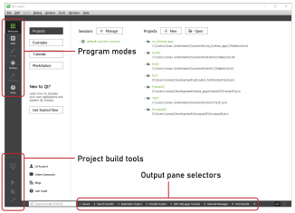
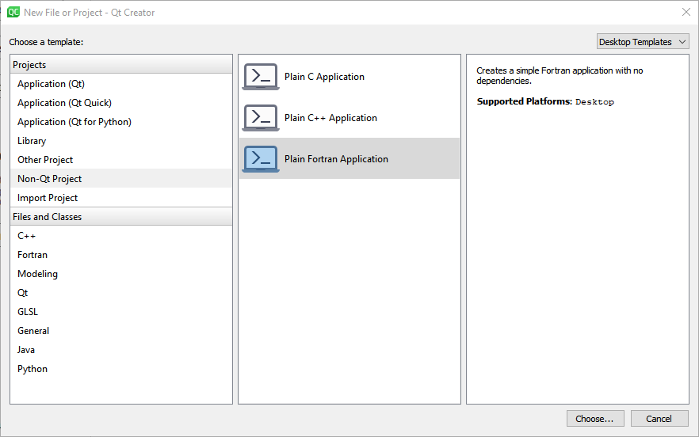
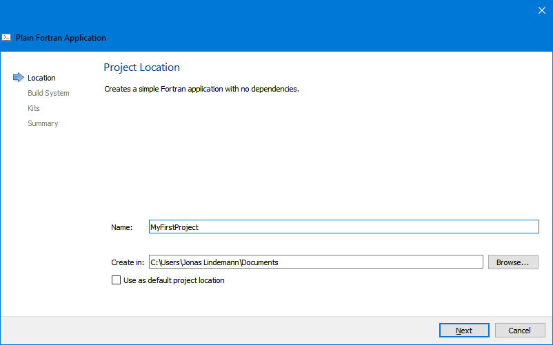
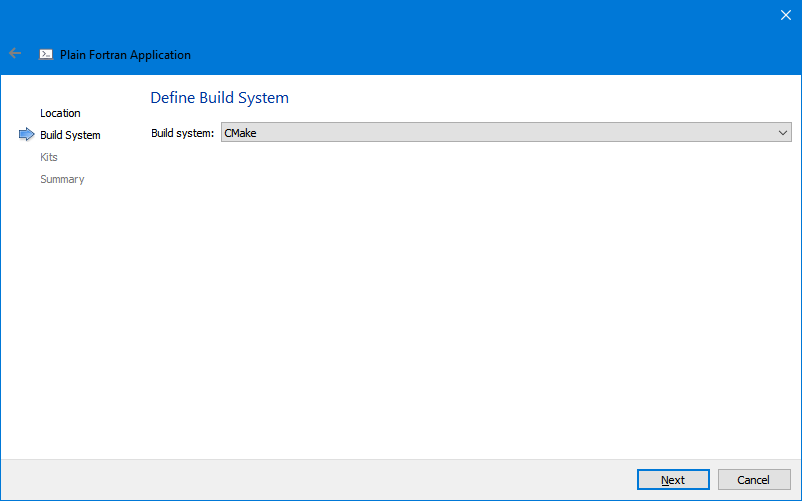
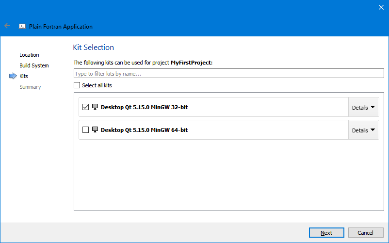
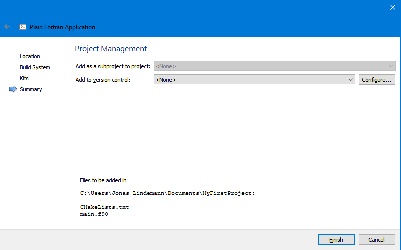
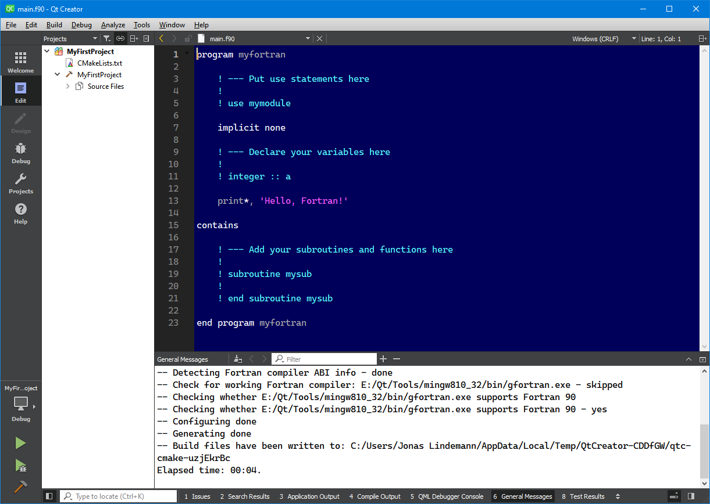
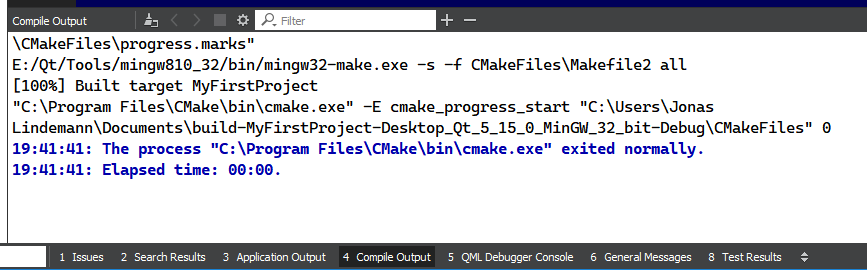
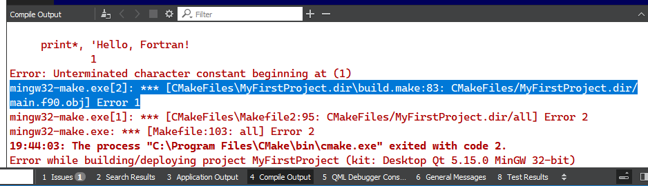

**********************
Qt Creator for Fortran
**********************

Qt Creator is a integrated development environment, IDE, for C++ and Qt, but can be easily adapted as a development environment for Fortran using plugins provided together with this book.

The user interface of Qt Creator resembles the one found in commercial alternatives such as Microsoft Visual Studio or Inte Visual Fortran. This chapter gives a short introduction on how to get started with this development enviroment.

To be able to use the Fortran Project templates and compile Fortran code in Qt Creator, require the following pre-requisites:

-  A working Fortran compiler available in the search path. On Windows this is best achieved by installing the MinGW packages when installing Qt Creator. On Mac OS X the gfortran compiler is available in the MacPorts or Brew distributions.

-  CMake installed and available as a command line tools. On Windows CMake can be installed when installing the Qt Creator environment. On Max OS X these tools are provided withe the MacPorts and Brew distributions.

-  Fortran Templates for Qt Creator which can be downloaded `here <https://github.com/jonaslindemann/qtcreator-fortran>`_. These templates work for all platforms. 

Starting Qt Creator
===================

Starting Qt Creator can be done from the Start-menu on Windows and from
the application launcher on Mac OS X. When Qt Creator has been launched
the main windows is shown in :numref:`fig-main-window`.

   Qt Creator main window

On the left side of the window, 2 toolbars are shown. The top toolbar
controls the main program modes of Qt Creator. The lower toolbar is the
project build toolbar, which controls how the projects are built and
run.

Qt Creator main program modes
=============================

There are 7 program modes in Qt Creator, controlling the workflow of the
development environment. The different modes are listed below:

-  **Welcome mode** - Shows a welcome screen, providing shortcuts for many
   of the common operations of the development environment.

-  **Edit mode** - This is probarbly the most used mode of the development
   environment. This mode provides access to the files within a project
   as well as an source code editor supporting most languages.

-  **Design mode** - In this mode user interfaces for Qt can be designed.
   This mode will not be used for Fortran development.

-  **Debug mode** - This mode will be activated when the application is run
   in debug mode, for interactive debugging your Fortran application.

-  **Project mode** - This mode provides access to settings that applies to
   the current project.

-  **Analyse mode** - Provides access to profiling tools. This mode will not
   be used in this book.

-  **Help mode** - Provides access to the online documenation provided by
   the development environment.

Switching between modes are in many cases done automatically. Debugging
an application will automatically switch to debug mode. Creating or
opening a project will automatically switch to edit mode.

Installing Fortran support in Qt Creator
========================================

As Qt Creator is not used by default for Fortran development, additional support for Fortran must be added to Qt Creator. We will use the templates and highlighting from the qtcreator-fortran  `project <https://github.com/jonaslindemann/qtcreator-fortran>`_.

Installing project and highlighting templates
---------------------------------------------

Detailed instructions on how to install the Qt Creator extensions are available here:

`https://github.com/jonaslindemann/qtcreator-fortran <https://github.com/jonaslindemann/qtcreator-fortran>`_

A video on how to install the extensions is also available on `YouTube <https://youtu.be/hOs3cfhnu7o>`_.

Creating a Fortran project
==========================

To use Qt Creator as a development environment for Fortran, a project has to be created. A project defines, which files that are required for building the program as well as any required settings. By default Qt Creator uses its own custom project format, but can also handle CMake based project, which is also what the installed Fortran plugins use.

To create a new project, select **File/New file or project...*** from the menu. This brings up the project/file creation window as shown in :numref:`new-project`.

   Qt Creator new project/file selection window.

Next, select **Non-Qt Project** and select the **Plain Fortran application** and click the **Choose...** Button as shown in :numref:`project-name`.

   Choosing a project name.

Enter a name and directory for your Fortran application and click **Next**. Next select the build system, CMake, in the next step shown in :numref:`select-build-system`.

   Select build system.

Click **Next** to continue. In the next step we need to select which compiler toolchain to use. In Qt Creator a toolchain is called a kit. Select one of the presented kits as shown in :numref:`select-toolchain`.

   Select compiler toolchain (Kit).
   
Click **Next** to continue. In the next step a versioning system can be selected, but this can be skipped, see :numref:`select-versioning`.

   Select version control system.

Click **Finish** to finish the project creation. If all worked a new CMake Fortran project should have been created as shown in :numref:`new-project-created`

   New Fortran project created.

Building the project
====================

Building the project is done either by selecting **Build/Build [Project name]** from the menu or  using the build button in the bottom left of the window as shown in :numref:`build-app`.

   Building a Fortran application.

The results of the build process is shown in the **Compile output** pane as shown in :numref:`compile-output`.

   Output from application compilation.

Errors during the build will also be shown in the **Compile output** pane. An example of this is shown in :numref:`compile-errors`.

   Compilation error.

Running the project
===================

Running the finished application can be done by selecting . This will
run the first target in the project. If the CMakeLists.txt file contains
more targets (add_executable), the selected executable to run can be
selected by clicking on the ”Terminal” icon in the lower left toolbar.
This brings up a menu in which you can select the target to run as shown
in the following figure: